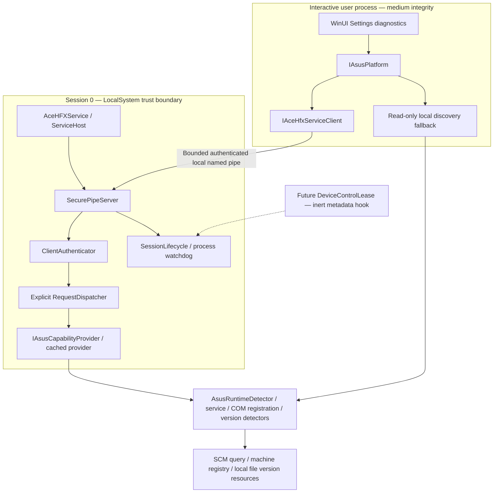

# ASUS platform — Phase 3 M1

> **M1 HISTORICAL CHECKPOINT.** The original command inventory and metadata-only
> scope below describe M1. The alpha.7 additive cooling IPC extension is described
> in the dated note in the protocol section; it does not relabel M1 evidence.

M1 adds a .NET 10 Windows platform boundary and an independent LocalSystem service.
It performs metadata discovery only. No ASUS COM activation, vendor DLL loading,
device opening, IOCTL, RGB submission, fan operation, ownership acquisition or vendor
service administration is implemented. The existing user-session C++ daemon, direct
Ace HFX HID transport, profiles, GSI and Studio remain independent.

## Components and dependency direction



`src/AsusPlatform` owns DTOs, interfaces, detection and the typed transport;
`src/AceHFXService` owns service hosting, dispatch sessions, capability caching and
structured event logging. WinUI pages reference `IAsusPlatform` and evidence models.
There are no ASUS COM interfaces in production M1. Only four canonical coclass IDs
are retained for registry queries: AuraSdk, AuraDevelopment, ServiceMediator and
FanControlManager. They come from Phase 2.1 generated TypeLib bindings; no method
definitions were invented or copied.

The research paths requested for M1 are absent from the current `main` checkout.
Implementation referenced the existing local
`audit_artifacts/backup_pre_rollback_20260929_2325/docs/research/` and corresponding
`src/research/generated/` backup. This is provenance, not a runtime or build dependency.
No backup source tree or proprietary binary is copied into production.

## Pipe security and client authentication

Production pipe: `\\.\pipe\AceHFXPlatform`, byte mode, overlapped I/O,
`PIPE_REJECT_REMOTE_CLIENTS`, one instance and `FILE_FLAG_FIRST_PIPE_INSTANCE`.
An existing pipe with this name causes a fail-closed retry, not attachment to that
pipe. A protected DACL grants SYSTEM/Administrators full server administration;
the intended user gets `0x12019b` (read/write data, attributes and extended
attributes, READ_CONTROL and SYNCHRONIZE). That mask excludes
`FILE_CREATE_PIPE_INSTANCE`, WRITE_DAC and WRITE_OWNER. Neither Everyone nor
Authenticated Users is granted access. SYSTEM/Admin ACL access does not exempt
a client from the interactive-user authentication policy.

The intended user comes from Windows WTS primary tokens. Prefer a logged-on active
console user. If the console has no user, select the unique active logged-on session;
if no active session exists, allow the unique disconnected but still logged-on session.
Ambiguous sessions fail closed. This explicitly supports a desktop application that
continues running after remote desktop disconnect; logoff is different from disconnect.
No username, supplied SID or client-selected session participates in selection.

Before dispatch, the broker reads one bounded hello frame, obtains
`GetNamedPipeClientProcessId` and `GetNamedPipeClientSessionId`, opens a retained
process handle and queries its primary token. TokenUser SID and token SessionId must
match the selected user/session and the pipe session. A pipe impersonation token SID
is cross-checked against the process token SID. The process must still be alive both
before and after validation. The handle remains open for connection monitoring, so
PID reuse cannot silently transfer ownership. Authentication never dispatches a
request under the client impersonation token.

The client uses explicit pipe rights and identification-level SQOS. Before sending
hello, it checks the OS server PID against the running SCM AceHFXService PID,
requires server Session 0 and checks the administrator-owned service account
configuration is LocalSystem. It does not attempt a privileged SYSTEM token query
from medium integrity, or trust JSON server identity as authentication.

Console development uses `AceHFXPlatform.Dev.<pid>`; it cannot masquerade as the
production service, and the production client has no authentication bypass.

## Capability evidence

`AsusPlatformCapabilities` includes Aura, Cooling, Services, Components and
SecurityContext; component records include version evidence. Each component separates
Installed, Registered, Running, Accessible and Validated. Evidence contains a stable
capability state, execution state, nullable value and language-neutral reason.

Capability states are Unknown, Available, Unavailable, PermissionDenied,
InstalledButStopped and VersionUnsupported. Execution states are NotAttempted,
Succeeded, Failed, PermissionDenied and Unavailable. NotAttempted values are null.
No device enumeration result or default zero device count is produced in M1.

Available on `StackDetected` means running prerequisite service plus canonical COM
registration only. It never means usable hardware control. Accessible and Validated
remain NotAttempted because no vendor activation or hardware validation occurs.
Versions are metadata, with compatibility Unknown; unknown/new versions are not
rejected. There is no exact-version allowlist.

Service/driver discovery queries LightingService, AsusFanControlService, asComSvc,
Asusgio3, AsIO3, AsusCertService, ArmouryCrateService, ROG Live Service,
ArmourySocketServer and AceHFXService. ArmourySocketServer falls back to a fixed-name
process observation when no SCM registration exists. A named process observation
does not establish vendor identity or persistent installation. Missing service/process
metadata is distinguished from unknown installation.

COM registration is inspected in both machine registry views. In-proc AuraSDK uses
the product's x64 registration; the verified out-of-proc ServiceMediator and cooling
manager may use 32-bit registration. HKCU COM overrides are not trusted by the broker.
Versions are read from registered local image paths without executing/loading them;
UNC/relative image paths are rejected. Shared memory support remains NotAttempted.
Dynamic Lighting is only an observation of the selected user's registry setting,
not proof that LampArray devices exist or are usable.

The broker caches snapshots for 30 seconds, logging component changes rather than
every poll. Snapshot timestamps and the observing process security context remain
visible. If the broker is absent/stopped, the normal application can still perform
local metadata discovery; IPC and privileged broker availability remain false.

## Protocol and errors

Each frame is a four-byte little-endian signed length followed by UTF-8 JSON.
Length must be 1..131072 bytes, checked before allocating the payload. JSON depth is
bounded at 16; only fixed request/response DTOs are deserialized. Root duplicate
properties, malformed JSON and type injection are rejected. Unknown extension fields
are tolerated and inert. Commands and error enum values are explicit numeric wire
contracts.

Requests carry protocolVersion=1, nonempty requestId (GUID) and command. Allowed
commands are ClientHello, Ping, GetProtocolVersion, GetServiceVersion,
GetServerIdentity, GetAsusRuntimeCapabilities, GetAsusServiceStatus and
GetAsusComponentVersions. Hello is required first. The dispatcher has no generic
Invoke, path, DLL, COM, IOCTL or hardware-write command.

Responses carry protocolVersion, requestId, success, error and optional diagnostic,
hello/capabilities/services/components fields. The hello describes protocol/service
versions and identity; Ping has no vendor side effect. Commands return only their
typed field. Client responses must match the requested ID and protocol and have a
consistent success/error envelope.

### alpha.7 additive cooling IPC note — 2026-10-04

Existing IDs 1–8 are unchanged; new ID 9 is additive:
`GetCoolingReadOnlySnapshot=9`. `Protocol.Version` remains 1. The required request
shape (protocolVersion, requestId, command), framing and ClientHello-first handshake
are unchanged. Responses add the optional typed `cooling` field; older fixed DTOs
tolerate unknown extension fields. Unknown numeric commands fail safely with
`UnsupportedCapability`; a server with no cooling provider returns
`CoolingReadNotSupported` without invoking a worker.

The authenticated AceHFXService pipe routes command 9 through `DispatchAsync` to
`ICoolingReadOnlyProvider`. `AsusPlatform.GetCoolingAsync` calls it through
`IAceHfxServiceClient`; WinUI Settings uses that read-only snapshot. Provider
availability and telemetry errors remain explicit inside the Cooling snapshot.
This extension grants no cooling writes. Its wire round trip, ID mapping,
accepted/rejected dispatcher paths, unavailable provider and authorization barrier
are covered in `ProtocolTests`; no physical cooling validation is implied.

Errors are None=0, ServiceUnavailable=1, ComponentMissing=2, AccessDenied=3,
ProtocolMismatch=4, UnauthorizedClient=5, MalformedRequest=6, RequestTooLarge=7,
Timeout=8, UnsupportedCapability=9, VendorApiFailure=10, InternalError=11,
DuplicateRequestId=12 and TruncatedFrame=13. Unknown commands use
UnsupportedCapability. A frame failure before an ID is available has Guid.Empty;
parsed authentication rejection can return the parsed ID without dispatch. Error
responses are best effort; disconnected clients receive no guaranteed response.

Each client operation has a five-second total deadline. Server frame reads have
five-second deadlines; connections have a 30-second lifetime and at most 128 requests.
Request ID storage is bounded to that connection and discarded on disconnect.
Duplicate IDs within a connection are rejected. IDs across reconnects are independent
because M1 commands are read-only. Capability metadata queries are synchronous OS/file
queries, not untrusted vendor execution; their underlying Windows APIs are not forcibly
interruptible. Future vendor calls need isolated timeout handling before introduction.

## Lifecycle and future leases

SCM starts ServiceHost as LocalSystem. Stop/shutdown cancel the listener and connection,
await cleanup and log termination. Every listener generation watches the selected
WTS user/session at 500 ms; a selection change or logoff cancels pending accepts and
connections before recreating the ACL. The selected user is checked again after
accept and before subsequent dispatch. A 250 ms process watchdog closes dead-client
connections. Normal disconnect, timeout and process crash dispose SessionLifecycle.
Reconnect creates a new authenticated connection; concurrent attempts wait for the
single bounded listener or time out. M1 deliberately uses one connection at a time.

`DeviceControlLease` is an inert record with LeaseId, OwnerPid, OwnerSid, CreatedAt,
LastHeartbeat and ExpiresAt. SessionLifecycle exposes the authenticated owner and
connection ID, validates ownership when a future internal lease attaches, and clears
metadata on disposal. No lease acquisition/renewal is exposed over IPC in M1, and no
hardware restore method exists. Future leases must implement monotonic expiry,
recovery and vendor ownership policy with separate physical validation.

## Build, development installation and diagnostics

```powershell
dotnet build Aura.slnx -c Release -p:Platform=x64
dotnet test tests/AsusPlatform.Tests/AsusPlatform.Tests.csproj -c Release
pwsh -File tools/package_asus_service.ps1 -OutputDirectory audit_artifacts/phase3-m1/fresh-candidate
```

From an elevated PowerShell, after reviewing the candidate:

```powershell
powershell -NoProfile -File tools/install_asus_service_dev.ps1 -CandidateDirectory G:\Aura\audit_artifacts\phase3-m1\fresh-candidate
```

The installer rejects an existing service/destination, verifies the self-contained
x64 manifest, rejects reparse payloads, copies only listed files into the protected
Program Files destination, verifies copied hashes, creates the Windows Application
event source, and registers/starts only AceHFXService. It never launches the service
from the user-writable checkout or bundles ASUS binaries. The candidate manifest
provides consistency verification, not a code-signing trust root. Installation is a
trusted administrator operation. Startup is Manual for development.

No app elevation is required. Settings adds one collapsible read-only status area
and an explicit refresh button. No installation/start/stop UI or new polling loop is
added. Core evidence remains language-neutral; the status presentation is Chinese.

Diagnostic commands:

```powershell
dotnet run --project src/AceHFXService -- --discover
& 'C:\Program Files\AceHFXAura\AceHFXService-M1\AceHFXService.exe' --client-status
dotnet run --project src/AceHFXService -- --console
Get-WinEvent -FilterHashtable @{LogName='Application'; ProviderName='AceHFXService'} -MaxEvents 20
```

CI runs the software/model tests through tools/ci/run-ci.ps1. Real desktop pipe tests
use DesktopSmoke and are executed locally in a logged-on desktop; CI service sessions
must not be misrepresented as interactive-user tests. Production broker acceptance,
actual logon/logoff and shutdown require their separate Windows evidence.

## M2 boundary

M1 ends here. Recommend first validating the existing canonical read-only COM metadata
surface in bounded isolated workers, then designing vendor-specific ownership and
recovery tests. Any fan/RGB write, lease acquisition or service-removal experiment
requires an explicit later scope and physical acceptance. No M2 work is implemented.
