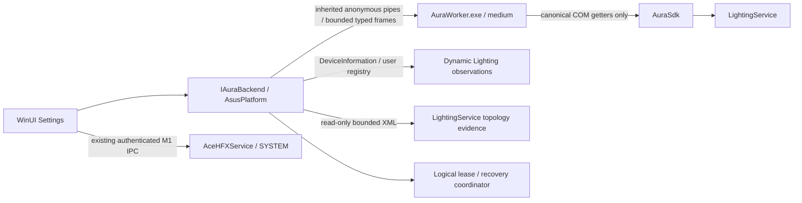
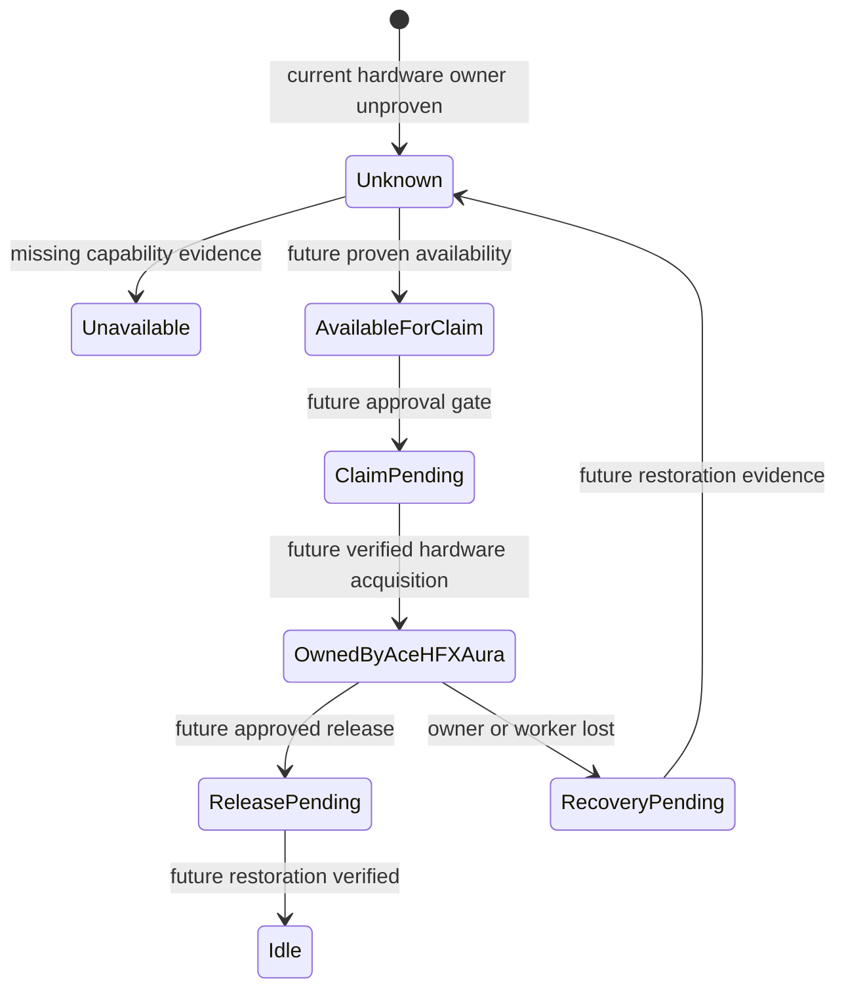

# Phase 3 M2 — Aura read-only runtime

M2 adds a medium-integrity native Aura worker. ASUS code never loads into WinUI,
AsusPlatform's managed assembly, or the LocalSystem broker. M1 remains installed
without replacement/restart. Cooling, M605/HID, profile, Automation v2, GSI and Blockly are unchanged.

## ABI and evidence

The native worker avoids the managed-host termination observed in Phase 2.1.
`CanonicalAuraAbi.h` copies exact TypeLib-derived vtable order, including prohibited slots:
IAuraSdk/2/3, device/light collections, device/light interfaces and IAuraMbLight's LocationId getter.
There are no acquire/setter/Apply call sites. IServiceMediator is not needed: existing XML supplies
non-authoritative topology evidence without extra activation. Product code never reads research files.
Provenance is recorded under M2 audit artifacts; canonical research is in the existing rollback archive
because it is absent from main. No broad reverse engineering was repeated.

Fixed enumeration category IDs (not flags) are 0, 0x10000–0x80000, 0x120000 and 0x2F0000,
from the verified generated constants and DevLastStatConfig evidence.
`DeviceCount` is nullable: only all successful Enumerate/Count queries permit a count.
It sums category observations, not physical hardware. UniqueComIdentityCount uses canonical
IUnknown identity retained alive within one worker. Names never prove duplicate identity.
Runtime IDs include fresh BackendInstanceId and category/index; no stable physical ID is invented.
Each getter retains execution/HRESULT/nullable value. Width × Height mismatches and getter failures
remain explicit anomalies; no matrix is fabricated.

XML LocationId matches are at most Probable without independently corroborated device identity.
XML last-sync lists are cached configuration, not current ownership proof. Reads are bounded to 2 MiB,
DTD/external entity resolution disabled, shared read-only. Missing/ambiguous mappings remain Unknown.

Capabilities distinguish Installed, Registered, ServiceRunning, WorkerReachable, ComActivated,
EnumerationSucceeded, DevicesFound, ReadableTopology, OwnershipApiPresent, OwnershipValidated,
RealtimeBackendDetected and RealtimeBackendValidated. QueryInterface support is not ownership validation.
Unknown versions do not prohibit discovery. TimedOut=5 and new errors 14–16 append existing M1 values;
M1 commands and old numeric values remain unchanged.

Dynamic Lighting reads scalar current-user registry values and enumerates DeviceInformation using
LampArray.GetDeviceSelector. It never calls FromIdAsync, sets IsEnabled, registers ambient effects,
changes settings or opens a control session. Enabled PnP interfaces/user flags cannot prove current
ambient ownership or Aura participation. Registry evidence is labeled as user-setting observation.

## Logical lease and watchdog

The shared M1 DeviceControlLease DTO adds SessionId, WorkerPid, BackendInstanceId and OwnershipState
with optional defaults; the M1 connection hook remains data-only. Discovery serializes sessions,
associates a logical lease with OS SID/PID/session and worker, heartbeats, rejects duplicates/mismatched
identity and clears metadata after OS job cleanup. Logical OwnedByAceHFXAura never means real hardware
ownership; ObservedHardwareOwner and runtime ownership remain Unknown.

Hardware transitions above are design-only. RequestHardwareOwnership always returns
AuraWriteApprovalRequired. Logical simulations emit AcquireStarted/Acquired/Heartbeat,
ReleaseStarted/Released and RecoveryRequired/Succeeded/Failed with HardwareAcquired=false,
bounded to 128 history entries. Recovery inputs cover UI/worker exit, timeout, user/broker disconnect,
session change, lease expiry and graceful exit. Tick accepts lifecycle observations; disconnect tests
inject these inputs without restarting services or logging off. Aura read-only discovery itself does not
depend on broker availability. Trusted lifecycle wiring is required before future hardware acquisition.

Normal M2 discovery needs no persistent journal because no hardware is acquired. The optional logical
crash-journal utility records explicit boot epoch, rejects other boots/hardware claims, and cannot
authorize vendor release from disk. Parent-death fixture proves metadata survives after the UI-like host exits.
Approved ownership needs an independent trusted watchdog and verified restoration route; OS worker
termination is not proof that LightingService resumes control.

## Build and validation

`dotnet build Aura.slnx -c Release -p:Platform=x64` builds sidecars through CMake/MSVC.
WinUI build/publish includes native AuraWorker.exe with static VC runtime, no ASUS binaries.
`dotnet run --project tools/AuraDiagnostics -c Release` performs read-only host discovery.
`dotnet test tests/AsusPlatform.Tests -c Release` builds software fault fixtures excluded from product publish.
The M2 patch is relative to the supplied M1 working tree. See
[runtime architecture](AURA_RUNTIME_ARCHITECTURE.md) and
[ownership experiment](../testing/AURA_OWNERSHIP_EXPERIMENT.md).
