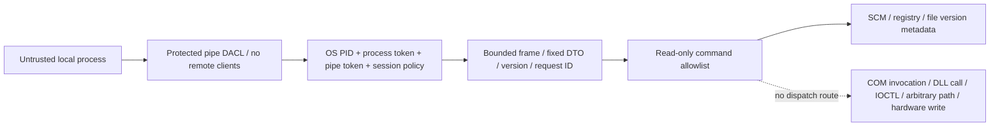

# ASUS platform privileged broker threat model

## Trust boundary

Trusted: Windows SCM/WTS/token APIs, the reviewed AceHFXService binary and its .NET
runtime/dependencies in an administrator-protected directory, the machine service
configuration, and installation by an administrator. Administrators and SYSTEM are
outside the local unprivileged attacker boundary: they can replace services and binaries.
The service is currently LocalSystem to support the future cooling broker. Its M1
command set is exclusively metadata and does not consume vendor code.

Untrusted: all local clients, JSON, client-provided identities, unknown fields,
request timing, pipe name occupants, and same-user applications. Authenticating a user
does not prove that the executable is Aura. The current read-only policy accepts any
process of the intended SID/session. Binary/signature policy, stronger user intent
and operation-specific authorization must be decided before adding mutating operations.

## Identity spoofing and pipe squatting

The user SID comes from WTS tokens, never a username or request. The client PID comes
from GetNamedPipeClientProcessId. Retaining the process handle, comparing TokenUser
and token/pipe SessionId, cross-checking the pipe token SID, and checking process
liveness prevent PID-only authentication and reduce handle-duplication/PID-reuse risks.
A changed intended session cancels its listener and connections. The single eligible
disconnected-session fallback does not broaden to other logged-on users. Ambiguous
session selection rejects access. Client DACL rights omit pipe-instance creation.

The server refuses an existing pipe name via FIRST_PIPE_INSTANCE. The client binds
the OS server PID to the actual running SCM service, requires Session 0 and LocalSystem
machine configuration. Identification SQOS prevents the server from using the client
token for impersonated privileged actions. JSON hello is diagnostic, not a trust root.
Pipe squatting by an attacker can still deny service startup; it cannot yield an
authenticated production endpoint. Administrator replacement is outside this threat model.

## Malformed IPC and denial of service

Negative/zero/oversized lengths fail before allocation. JSON shape/depth and duplicate
root properties are checked; fixed DTOs cannot resolve injected type names. Unknown
commands/versions and duplicate IDs are rejected. Incomplete frames, broken connections
and exceptions are contained to the connection. Frames and connections have deadlines,
request counts are bounded, and ID history does not accumulate beyond a session.
Error writes have a 200 ms deadline. No request payload or sensitive token content is logged.

A same-user client can occupy the one listener for a bounded period (up to 30 seconds)
or reconnect repeatedly, and can generate authentication/IPC event logs. Availability
against a malicious authorized same-user process and global log rate limiting are not
claimed. Metadata snapshots are cached for 30 seconds, avoiding repeated vendor discovery
on every request. Slow OS metadata calls are not forcibly terminated; no vendor COM
or DLL runs, so future vendor integration must add timeout isolation explicitly.

## Privilege escalation prevention

There is no command supplying a file/path, service name, CLSID, DLL export, method,
IOCTL or hardware argument. The allowlist is typed and read-only. Machine COM registration
is queried without HKCU override or activation. Registered images are inspected for local
version resources only, never loaded. UNC and relative paths are rejected. A process
named ArmourySocketServer is only an observation, not trusted executable attestation.
No per-user plugin/config is loaded by the privileged service.

The installer rejects reparse payloads, validates hashes before and after copy and
applies SYSTEM/Admin full control with Users read/execute in Program Files before
service registration. It refuses replacement of existing installations. A malicious
administrator-selected candidate/manifest is not prevented by hashes: signature/trusted
distribution verification is a later packaging requirement, not an M1 security claim.

## Future hardware lease gate

Lease metadata is connection-owned and cleared on every disconnect/timeout/shutdown.
It cannot acquire or release ASUS ownership in M1. Before enabling writes, define
per-command authorization, identity pinning policy, validated range/topology constraints,
monotonic expiry, recovery semantics, bounded vendor execution and physical acceptance.
Do not turn the existing discovery surface into an arbitrary vendor-call broker.

## API references

- [Named pipe security and access rights](https://learn.microsoft.com/en-us/windows/win32/ipc/named-pipe-security-and-access-rights)
- [CreateNamedPipe flags and remote-client rejection](https://learn.microsoft.com/en-us/windows/win32/api/winbase/nf-winbase-createnamedpipew)
- [GetNamedPipeClientProcessId](https://learn.microsoft.com/en-us/windows/win32/api/winbase/nf-winbase-getnamedpipeclientprocessid)
- [WTSQueryUserToken and LocalSystem requirements](https://learn.microsoft.com/en-us/windows/win32/api/wtsapi32/nf-wtsapi32-wtsqueryusertoken)
- [PipeAccessRights implementation](https://source.dot.net/System.IO.Pipes/System/IO/Pipes/PipeAccessRights.cs.html)
