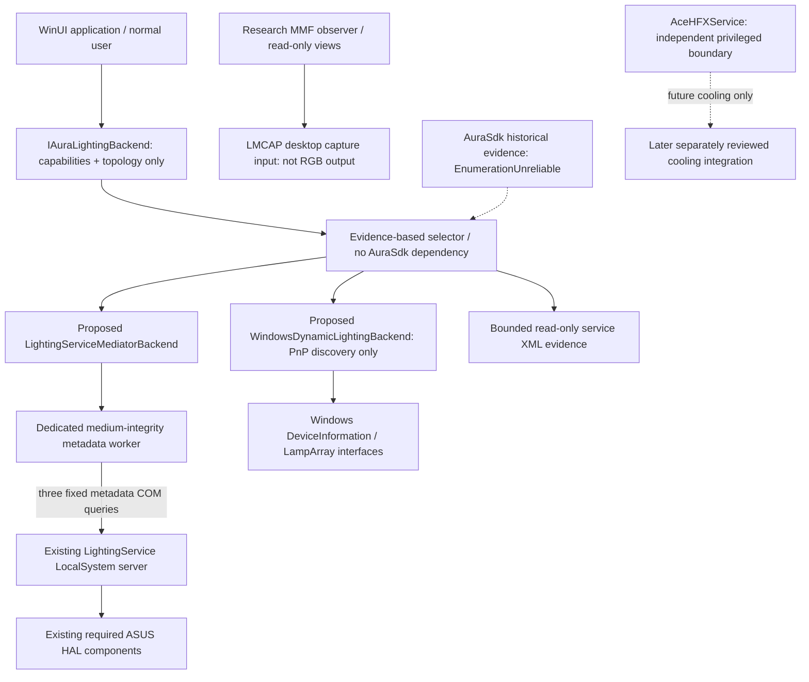

# Aura backend selection — Phase 3 M2.8

## M2.10 final write-backend decision

**SERVICE_MEDIATOR_WRITE_BACKEND_REJECTED**, for the currently verified installed binaries and evidence.
This is the final bounded static-contract round. It supersedes the M2.9 request for another generic
addressing/restore investigation. No S1 target, write candidate or hidden execution flag is created.

| Backend | Current architecture decision |
|---|---|
| ServiceMediator | ReadOnlyDiscovery = Supported; LightingWrite = UnsupportedOnCurrentEvidence |
| AuraSdk | RuntimeEnumeration = Unreliable; LightingWrite = Unsupported |
| LMCAP | DesktopCaptureInputOnly; no producer/output backend |
| WDL | Falchion-specific candidate only; no control opening or output approved |

The ordinary AuraPlugin V1 path constructs Group/effect/LED XML and sends SetProfile with constant1.
It uses current mutable plugin state, the service's shared manager and persistence/engine transitions.
Logical XML keys are not a proved isolated physical target. LastProfile is updated during application;
SetScript can overwrite fixed LastScript.xml. StartEngine cmd0 reads the currently saved script,
stops global engine state and changes mode even on load failure. Internal RestoreAll reapplies current
persisted configuration with mode/exclusive/token conditions; no complete predecessor snapshot,
previous-owner release or bounded failure compensation was recovered. GetProfile remains E_NOTIMPL.

See [XML contract](../research/aura-profile-xml-contract.md),
[lifecycle](../research/aura-profile-lifecycle.md),
[baseline/restore analysis](../research/aura-profile-restore-analysis.md) and
`audit_artifacts/phase3-m2.10/backend-decision.json`. Earlier runtime observations remain intact.
This rejection is evidence-qualified, not a claim that all ASUS versions or all possible contracts
can never support output. A new unknown version is compatibility unknown, not silently enabled.

Remaining non-keyboard output choices are explicit: retain the vendor lighting application/service
as the output owner while AceHFXAura exposes diagnostics; reopen output only on a supported, documented
per-target state/restore contract or materially new vendor implementation with independent qualification;
or separately review a documented device-specific/controller backend for hardware that actually
offers independent addressing. None is selected or authorized here. WDL cannot address the currently
unexposed motherboard/GPU/DRAM/cooler merely because the keyboard interface exists. No lower-confidence
ServiceMediator, AuraSdk, MMF or HID mechanism becomes an automatic fallback.

Medium-user isolated metadata COM remains the preferred boundary. No lighting COM is added to
AceHFXService/LocalSystem, and production worker/UI/M605 behavior stays unchanged.
ReviewedGateAExecutionEnabled=false; GateA=BlockedByAuraSdkRuntimeInstability.

## M2.9 contract review update

Read-only ServiceMediator topology remains preferred; lighting output is **SERVICE_MEDIATOR_S1_BLOCKED**.
Current TypeLib was fully re-extracted. GetProfile returns E_NOTIMPL; runtime record/family/profile
section/matrix AP namespaces differ. Matrix payload targets special controller types and is not a
generic519/1122-element frame for this host. Global/persistent control flags and lastscript reload
do not establish deterministic previous-owner/effect restoration. No S1 target or executable candidate
is prepared. Details: [addressing](../research/servicemediator-addressing-model.md),
[restore](../research/servicemediator-restore-contract.md), [surface inventory](../research/servicemediator-control-surface.md).

WinUI and AceHFXService continue to be isolated from medium-user lighting COM. Do not move it into
LocalSystem. The metadata20-second forced-kill deadline cannot be reused as an owner-release contract;
a future owner must be self-contained and retain its restore-capable object independently of WinUI.
AuraSdkRuntime=EnumerationUnreliable; GateA=BlockedByAuraSdkRuntimeInstability;
ReviewedGateAExecutionEnabled=false. No automatic AuraSdk fallback, LMCAP producer, WDL control
opening or M605 path replacement was added. The M2.8 comparison below remains historical evidence.

Decision: **ALTERNATIVE_AURA_BACKEND_NOT_READY** for lighting output. Preferred **read-only
metadata architecture: LightingServiceMediator**. Actual activation and topology/status queries
have been verified from standard-user processes without AuraSdk enumeration. Restoration and
write/addressing contracts remain unverified, so this preference does not enable an output backend.

Evidence: [current runtime analysis](../research/lightingservice-runtime-analysis.md), machine-readable
`audit_artifacts/phase3-m2.8/backend-decision.json`. This supersedes the assumption that AuraSdk
Enumerate is mandatory for discovering LightingService topology. It does not silently change the
existing production worker, UI/backend registration, M605 protocol or service deployment.

## Boundary and dependency direction

The actual C# contract is `src/AsusPlatform/Aura/LightingBackendCapabilities.cs`. It defines
IAuraLightingBackend's read-only methods, source-qualified LightingDeviceDescriptor, confidence,
runtime qualification and a pure selector. No setter/frame/ownership/lease/generic Invoke method
exists. The three concrete class names are a **proposal**, not shipping implementations. The current
standalone probe is a validated read-only adapter prototype; it is not product-wired or published.
LightingServiceSharedMemoryBackend is reserved as a rejected candidate name: no output implementation
should be built from the LMCAP capture protocol.

Vendor ABI/CLSID/dispatch plumbing stays in the isolated research worker; product/UI code does not
depend on the rollback research files. Productionization would use a reviewed fixed typed process
protocol and the same exception/size/deadline containment pattern. No privileged project service
is necessary for these medium-user metadata queries. AceHFXService keeps its separate future
privileged cooling role; no new vendor-call service endpoint is added.

Candidate A/B startup and any later frame path must have **zero dependency on AuraSdk Enumerate**.
AuraSdkBackend on this host is DiagnosticUnsupported/Experimental: Installed/Registered plus
EnumerationUnreliable, backed by M2.7 evidence and matching current binary hash. New versions require
new observations; unknown versions become compatibility unknown. The existing STA diagnostic worker
is retained unchanged as prior compatibility evidence, not automatically invoked by this selector.

## Comparison based on evidence, without numeric ranking

| Requirement | AuraSdk | IServiceMediator | LMCAP_FRAME | WDL |
|---|---|---|---|---|
| Startup reliability | historical MTA 18/18 failed; stable STA empty | final 3/3 activation + 9/9 queries succeeded; initial 3 also succeeded | live Local/Global objects absent | PnP enumeration succeeded, one interface |
| Requires ownership | control path needs separate gated review | metadata needs no ownership call; writes unknown | passive read no; not an output ownership channel | PnP discovery no; opening/control unvalidated |
| Topology discovery | unreliable MTA / empty STA | nine logical device records + capability/status XML | desktop frame shape, not lighting device topology | one Falchion HFX interface only |
| Per-device addressing | historical device object metadata only | type/model/index known; output addressing unknown | no device identifiers | interface ID exact; control object unopened |
| Per-light addressing | historical logical light counts | logical counts; Group 1122 vs 45 listed records; no verified mapping | desktop pixels, no physical LED addressing | lamp getters/count not attempted |
| Realtime suitability | not qualified | setters/SetLedMatrix not tested; latency of getters is not frame throughput | screen capture intervals in static code, not RGB throughput | standard capability possible for subset; no measured update limit |
| Crash isolation | existing worker contains client faults, vendor MTA still unreliable | isolated client + independent 20 s timeout; LocalServer health cannot be guaranteed | read-only bounds/copies; no live sample | metadata-only separate worker, bounded timeout |
| Armoury UI dependency | no minimal-stack acceptance | UI/CEF not observed; background dependencies remain unknown | add-on + desktop capture helper needed for this protocol | OS interface exists; ASUS background provisioning may matter |
| LightingService dependency | vendor stack dependent; historical | yes, already-running service | add-on screen-effect path; live lifecycle unobserved | interface enumeration is OS-based; vendor/WDL bridge dependency unknown |
| Standard-user accessibility | activation succeeded historically; MTA unusable | actual medium client activation/query verified | requested read rights; absence prevents access/ACL verification | actual medium PnP discovery verified |
| Known restore mechanism | Gate A blocked, normal restoration never tested | unknown: status XML is not a deterministic restore contract | none as RGB output; not a candidate for L1 | autonomous-mode/previous-owner restore unvalidated |
| Verification level | historical compatibility only | read-only metadata runtime verified | current static capture semantics + runtime absence | OS interface/USB parent verified; lighting disabled flag observed |

## Confidence and availability

Installed, Registered, Running, Accessible and Validated are different facts. The probe flushes
activation results separately from method results; a timeout after activation does not erase that
activation evidence. Failed or unfinished fields stay null. Descriptor confidence labels mean:

- RuntimeExact: the runtime returned this record/interface; no implied physical light-control proof.
- ConfigExact: exact parsed file record/hash; it may be stale/generated or describe capacity.
- StrongCorrelation: separate sources support a hypothesis, without a shared unique identifier.
- Unknown: identity/access/mapping not established.

All identities are source-qualified. Similar names never merge records. WDL's USB parent/container
proves the Falchion interface association; mediator WDL_Keyboard lacks that ID and stays a separate
record. ARGB count 120 is metadata capacity, not attached LED count. Group/Mainboard/WDL capability
sections are not nine individually validated control objects.

The selector may prefer validated metadata while selecting **no output backend**. An output candidate
requires independently validated protocol, per-device addressing and restoration together; multiple
eligible candidates require review. Even a fully qualified candidate does not make its write gate
executable. Human approval and a reviewed fixed-function candidate are separate requirements.

## Minimum runtime objective

LightingService + necessary HAL/device components is the preferred architecture target, not a
validated uninstall configuration. Current SCM dependencies are RPCSS/Audiosrv/DcomLaunch.
Metadata queries worked without an observed GUI/CEF/socket-server process, while ArmouryCrate.Service,
UserSessionHelper, AacAmbientLighting and HAL components were present. No component was stopped.
Static imports alone cannot exclude dynamic/startup/configuration dependencies. Do not uninstall or
stop those components based on M2.8. The current service states are not presumed identical to earlier
milestones: AceHFXService is currently stopped/manual and was not touched.

## Next review

M2.10 closes the generic ServiceMediator write-contract investigation with rejection on current
evidence. Keep Gate A [archived and blocked](../archive/reports/AURA_GATE_A_ARCHIVE.md); S1 has no
executable preparation path, and L1 remains rejected. WDL remains a keyboard-subset candidate whose
control/restore qualification would be a separate user-directed task. Historical
[first-write prerequisites](../testing/AURA_ALTERNATIVE_WRITE_GATE.md) authorize no operation.
Do not start another generic reverse-engineering round, output candidate, service change or fan feature.
