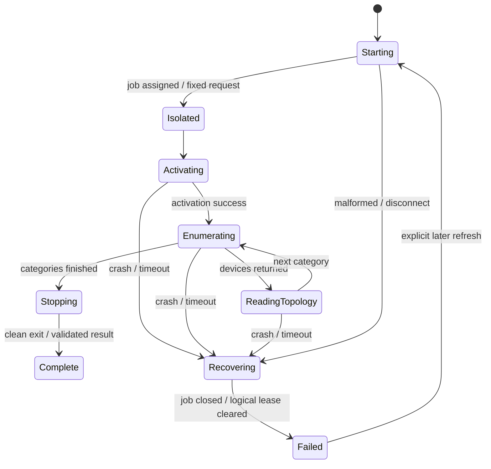

# Aura worker isolation and recovery

IAuraBackend returns metadata, never COM objects. The native worker inherits the application's ordinary
token and rejects elevated tokens before vendor activation. It is separate from privileged AceHFXService.

## Process contract

Fresh worker per discovery, explicit application-local executable path, no shell/visible terminal,
redirected anonymous pipes. One fixed discover command, version 1 and GUID request ID. Every response
repeats version/request ID, monotonically increasing sequence and OS child PID. Progress stages are
allowlisted. Four-byte little-endian frames: max 2 MiB, JSON depth 24. Duplicate properties at any level,
invalid counts/indices/categories, inconsistent values, malformed/truncated frames and wrong envelope
identity are rejected. No arbitrary vendor method/type/path/CLSID input or polymorphic deserialization.

Anonymous pipes are inherited OS handles between equal-privilege processes, not the M1 privileged trust
boundary. Before sending the request, the parent assigns the worker to a non-inherited kill-on-close
Job Object. The worker waits for that request before executing any vendor code. Parent crash closes
the job in the kernel, terminating the worker/descendants even without managed cleanup.

| Stage | Deadline |
|---|---|
| Startup / initial frame | 2 seconds |
| Activation / each Enumerate | 10 seconds |
| Each property / QI / collection operation | 3 seconds |
| COM reference cleanup / shutdown | 2 seconds |
| Total worker interaction | 90 seconds |
| Dynamic Lighting enumeration | 5 seconds |

Progress precedes native operations. Independent total deadline prevents indefinite extension by progress.
An explicit activation-result acknowledgement retains HRESULT/execution evidence even if a later
enumeration hangs or crashes; a later-stage timeout never rewrites proven activation success as failure.
Timeout closes the OS job, waits up to two seconds and returns VendorTimeout; no automatic retries.
Explicit later refresh creates a fresh worker/backend identity and discards prior COM state.
Worker ExitProcess/crash returns WorkerCrashed, malformed stdout returns a structured failure.
Stderr is continuously drained/discarded in a fixed buffer, avoiding memory growth/blocking and secret logs.
WinUI remains alive. Failed/incomplete enumeration retains null count.

Canonical ABI retains setter/acquire/release/Apply slots because deleting slots corrupts getter calls.
Those methods have no M2 call sites. IUnknown::Release is reference cleanup, distinct from prohibited
IAuraSdk2::ReleaseControl. Only the separate ownership experiment can prove restoration after crashes;
logical watchdog success is not vendor/hardware recovery success.

References: [Microsoft Job Objects](https://learn.microsoft.com/en-us/windows/win32/procthread/job-objects),
[LampArray selectors](https://learn.microsoft.com/en-us/uwp/api/windows.devices.lights.lamparray.getdeviceselector),
[Dynamic Lighting](https://learn.microsoft.com/en-us/windows/apps/develop/devices-sensors/lighting-dynamic-lamparray).
