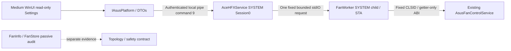

# Cooling backend architecture — M3.0

The pipe is a trust boundary using existing OS-derived client PID/token SID/session checks and restricted ACL. Authentication and typed protocol validation occur before a worker launch. Vendor objects never escape the worker; UI receives plain bounded DTOs. Worker startup checks SYSTEM/session, actual SCM parent PID and protected Program Files paths. Production publication copies the separate child beside the broker; test fixtures are separate and excluded.

Fixed command GetCoolingReadOnlySnapshot=9 adds an optional Cooling response without changing existing command values or legacy response fields. No generic COM forwarding exists. CoolingRuntimeCapabilities adds worker/activation/enumeration/curve-read/write readiness with nullable counts. Existing CoolingCapabilities still provides service/registration/component status; consumers combine it with the runtime snapshot instead of equating installation with usability.

FanChannelDescriptor and FanSensorDescriptor are distinct. VendorId/collection index are diagnostic IDs, not proven physical headers. NameID/manual mode/general sensors remain Unsupported/Unknown when no getter contract exists. Duty/curve/source values are raw; no UI unit conversion or writes. Explicit stable states distinguish NotAttempted, Succeeded, Failed, PermissionDenied, TimedOut, Unavailable, Unsupported and Unknown.

One global serialized worker launch; cache 1s on success / 30s after failure; fixed 3s timeout; at most 32 channels / 16 points each; bounded frame size. Malformed/oversize responses fail closed. Lost-worker activation/invocation progress is Unknown. External job termination is read-only isolation, not future write lease recovery. Broker lifetime does not depend on a client remaining connected; current reads own no hardware.

Service SCM configuration and installation ACL remain unchanged in M3.0. Candidate installation needs a separately authorized protected service deployment; never point SCM to the workspace. No broker elevation/UI elevation bypass was introduced. Existing M605 HID, profiles, game integration, simulation and lighting workers were left unchanged.

Lighting decisions remain closed: ServiceMediator discovery only; AuraSdk EnumerationUnreliable and no automatic fallback; LMCAP desktop-capture input; WDL keyboard-specific candidate. ReviewedGateAExecutionEnabled=false. No cooling write backend or F1 executable is present.
