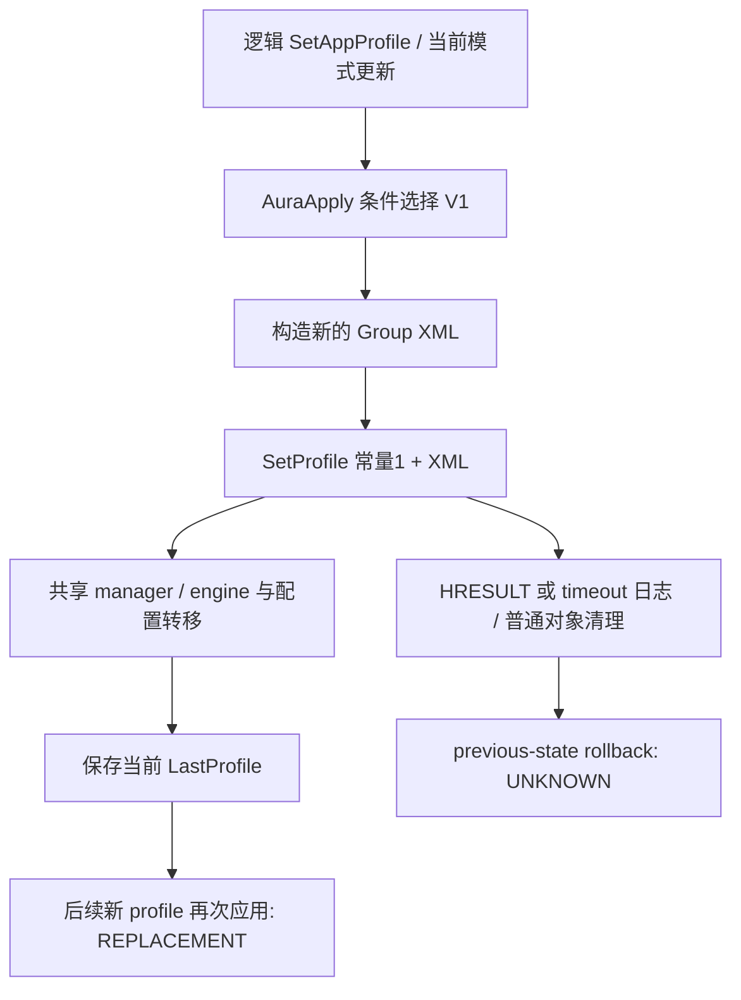

# ASUS AuraPlugin profile lifecycle — M2.10

最终只读审查恢复了一条普通 profile/effect **应用与后续替换**链，没有恢复临时 ownership rollback
transaction。`SERVICE_MEDIATOR_WRITE_BACKEND_REJECTED`。
机器证据：`audit_artifacts/phase3-m2.10/profile-call-sequence.json`、`provenance.json`。
模块、版本/hash、XML 边界见 [XML contract](aura-profile-xml-contract.md)。

## 上游逻辑动作及应用序列

以下是 native 静态路径，未启动 plugin 或调用任一 setter。条件成立的 V1 分支被单独恢复；
没有声称它就是本机现在使用的 live effect 分支。

| 顺序 | AuraPlugin RVA | 输入/动作/输出 |
|---|---|---|
| 1 | 0x0D90E0 | log 标识 UserProfileClass/SetAppProfile；读取逻辑 request 的 profile/mode，更新当前 mode global0x4FEF80，调用 AuraApply。此函数另有亮度/设备状态处理，并非纯 ServiceMediator transaction |
| 2 | 0x126950 | AuraApply 检查 session、设备/支持与模式；V2 未选中且有 V1 mode mapping 时，把 mapped mode、speed/music/color 等当前状态放入 helper/global LED records |
| 3 | 0x139580 | SendXmlToLightingService(`V1_ENGINE`) 把 helper funcid 字符串设成 `4`；LightingServiceControlLock→CreateThread(action,2)→等待对象 configured budget |
| 4 | 0x13A6B0 | LightingServiceActionThread 初始化 STA（CoInitializeEx(NULL,2)）；selector2 取 helper singleton并调用0x234C40；存放结果、CoUninitialize |
| 5 | 0x234C40 | 从当前 helper 和0x50-stride LED vector **新建** Group/S0/mode XML、序列化、写 AuraDlgSetProfile.xml；常量 `"1"` 和生成 XML交给 wrapper |
| 6 | 0x24A5E0 | 检查服务 ready；ProgID→CoCreate CLSCTX_LOCAL_SERVER；canonical IServiceMediator slot7（x64 offset0x38）传两个 BSTR；保存 HRESULT；释放 BSTR/普通 COM引用 |
| 7 | 0x139580 | 等待成功/超时/结果错误仅记录，CloseHandle、unlock。CloseHandle不是终止 action thread，更不是恢复灯光 |

普通 V1 这条外部调用序列为 **SetProfile("1", 新构造 XML)**；未发现必须随后依次
SetScript→SetEngine→StartEngine。不能把不同功能的 wrapper 拼成这样的假定顺序。
helper/current globals 在调用前已更新；没有在这条链中发现完整 immutable previous-state capture。

ASUS 的 AuraApply 在 `0x126950` 有 user-session 阻断、Session0 执行日志。这说明所追 ASUS
plugin 行为有其后台运行上下文；不能照搬到 normal WinUI，更不能为此把项目灯光 COM 放进
LocalSystem broker。M2.9 的 medium metadata worker 保持不变，不据 metadata 可访问性推导 write 权限。

## LightingService 内部状态转移

| Service RVA | 已恢复行为 | 未证明项 |
|---|---|---|
| 0x2D9340 | put_SetProfile body 在 mutex 内转共享 manager0x2C1F20；首次0x2CFAD0；funcid1/4 分支加载持久profile、再次0x2CFAD0 | 这是同一次 setter 内的二阶段处理，不是提交/撤销事务；两次都可能变更状态 |
| 0x2CFAD0 | XML解析0x2B16E0、funcid/version；global current funcid、registry/in-game/token 分支；funcid1/4→0x2C1AA0→0x2CE5A0 | 没有 client-scoped lease、saved prior owner 或 deadline |
| 0x2CE5A0 | Group S0→0x2CA0E0；Mainboard alias→Mainboard_Master；生成/保存 profile | 集合/LED key 的完整物理 routing 和 unrelated-device 隔离 UNKNOWN |
| 0x2CA0E0 | enabled/scene/mode 解析，currentMode fields 更新，调0x2CCC00 | 当前 mode 的业务值不等于先前 owner state |
| 0x2CCC00 | 先 stop executors0x2B7940；mode<18或100 经0x2C45B0和controller方法，条件调用0x2F7680等软件同步/engine分支 | 精确最后 HAL写点、物理 payload 全契约未恢复；不会执行验证 |
| 0x1F9B50 | SaveLastProfile 写同名持久文件，失败路径日志 | 没有 versioned predecessor、atomic full-state rollback |

这条应用链的第一个可能影响可见效果的外部 COM 调用就是 **SetProfile**。它内部已经有全局
模式/注册表/潜在 token/engine 状态转移；不能只把它看成“设置待提交 profile”。最终 physical
write 的时刻未精确到 HAL函数。caller 的 critical section 仅是 plugin 内串行化，不是跨进程
ownership，也未证明对其它 ASUS caller 有排他保护。

## 必须分开的其它路径

`0x128E20` SetEngineEffect 是另一条 UWP/V2 路径：先把 mode设100并 SendXml(`UWP_ENGINE`)，
该 helper命令为17；再根据已有 DLC/AIE/thermal script 是否存在，经过 `0x12A330` 发送
SetScript(rhs0)。它还包含设备特定处理。不是普通 V1 的必要尾部，也不是恢复序列。

AuraCreator `0x076BC0` 则在 dark 条件下先 LEAVEDARK→普通 SetProfile，再经 `0x1383D0`
传 script调用 StartEngine(cmd1,caller rhs)。不能推导退出时调用cmd0或退出自动rollback。

`0x13A550` 是 rescan/reset path（funcid8、Mainboard/resetall），
`0x13A6B0` selector5 则发送固定 **funcid14** XML。selector编号5与XMLfuncid14不是同一命名空间。
`0x280400` 将后者用于 scenario 的 StopLightingService 逻辑 request；该 log名称不是执行了
SCM StopService 的证据。所有这些路径本次均未运行。

## 后续替换、离开和错误

另选 profile再次修改当前 plugin 状态并进入相同 application path。AuraCreator
`0x076D30` ApplyLastMode 只是重新调用 AuraApply(`ApplyLastMode`)；它在所见函数中不携带完整
previous XML/owner/engine snapshot，故不能被 AceHFXAura 用作事务恢复契约。

没有从这条功能链恢复出 UI关闭、DLL卸载或临时effect结束时强制配对的
acquire→write→restore_previous→release。没有“未找到就是不存在”的全 ASUS 范围断言；这是本次
最终、有界调查的 UNKNOWN。普通 BSTR/COM/critical-section 清理不等于设备恢复。

wrapper0x24A5E0 保存 HRESULT并释放对象；0x139580 对超时/错误记录、关句柄、解锁；没有在
这些错误支路建立补偿写或完整 rollback。服务二阶段 apply和保存可能已产生部分变化；没有已证实
<=5秒 cleanup/completion bound。服务内部 RestoreAll 与 StartEngine(cmd0)见
[restore analysis](aura-profile-restore-analysis.md)，二者均不能作为安全的自动补救。

无新增 executable、hidden write flag 或 product adapter；停止这轮静态调查，不再以泛化研究延长S1。
