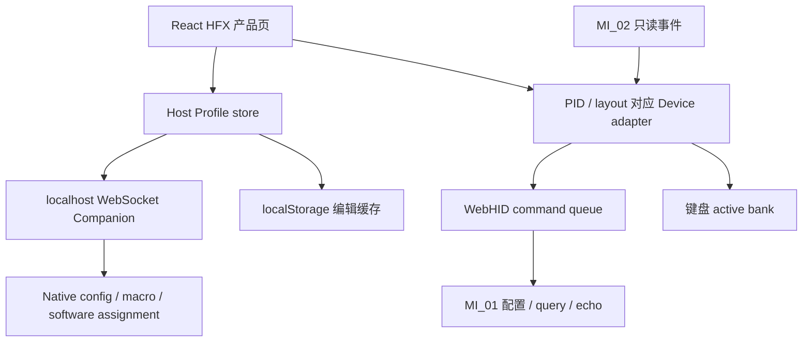

# ASUS Gear Link Full Product / Protocol Reference Audit

## 追加阶段：Computer Use / typed readback / 单槽持久化

详见 [执行日志](COMPUTER_USE_AUDIT_LOG.md)、[Typed Readback Audit](TYPED_READBACK_AUDIT.md)、[Readback Feasibility](READBACK_FEASIBILITY.md)、[单槽持久化报告](HARDWARE_BANK_PERSISTENCE_AUDIT.md)。这些是本阶段新结果，不替代下文原始整机观察。

Agent操作官方正常页面的四份capture未观察到指定参数query；SDK getter仍是STATIC候选。随后槽位5的准备阶段捕获未计划的3/1 bank切换，与可见slot5不一致，因此single-slot persistence暂停，尚未拔插，未作Physical PASS。并行AuraOwnershipExperiment被检测到，但USBPcap不能证明发送进程。Owner允许解除灯光同步；官方按钮点击后warning仍未解除，停止该case。

用户现在不在电脑前，本阶段只完成offline证据/工具/tests/docs；没有生产化readback，也没有自动恢复未知bank。测试slot5 host intent与原始baseline都保留，报告明确列出待恢复状态。

## Executive Summary

1. **架构**：Remix/React 浏览器壳、按 PID 加载的 React/Vite 设备模块、Zustand 状态和 mutation/query 层。HFX 控制主要是直接 WebHID；Gear Link Companion 的 localhost WebSocket 提供配置文件、宏、软件快捷键等扩展能力。不是把所有操作经 DLL/native helper 转发的单一路径。
2. **真正读取的状态**：本次捕获证实 firmware、Profile count、active slot、current lighting effect、物理 RT gate 与 SpeedTap master 查询。AP/DZ/RT 参数的普通刷新大量依赖 host cache；共享库有查询方法，不能据此称整个页面是固件 readback。
3. **Profile**：用户选择有限硬件槽位，浏览器/native host 同时保存编辑意图。普通切换不是逐键重放完整配置。用户确认磁轴与灯光一同恢复。
4. **Bank**：本机查询 count=6；最后一个槽位在 UI 标为默认。`51 00 ... slot` 后 BasicInfo 的 active slot 随之变化。它至少是 active bank selection；不能定义成可独立选择而不影响 active 的 edit-bank API。
5. **Magnetic**：AP/DZ 有共同参数与逐键记录；RT 是被选择的键的完整 per-key state，物理开关独立；DKS 四槽且 RT 选择排除冲突键。SpeedTap 是键对功能，未做独立物理验收。
6. **Lighting**：十种 effect、每槽位缓存各 effect 参数；`51 2C` 一/二/三包按 effect 构建，`51 2D` 控制部分 effect 的模拟灯效。用户确认没有独立逐键 RGB 或灯条编辑入口。固件切换 bank 能恢复灯效，不能因此假设 Gear Link 提供 Aura 的逐 LED streaming contract。
7. **Aura 的差异**：Aura stable GUID + sparse managed host intent 与官方 bank 完整状态选择是不同产品契约；unmanaged 不可悄悄当 Standard/disabled。RT 三态与 gate 的分离符合证据。Lighting Ownership 仍缺明确退出/恢复契约。
8. **可直接改善的产品坑**：更明确的 managed/unmanaged UI、DKS/RT 禁选和显式 Standard authoring、清晰标注 host cache 与实际 query、默认槽位/重连提示。必须经独立实施任务；本轮不改生产。
9. **仍需验证**：AP/DZ 单键移除是否真的恢复 inheritance、未知 RT bulk/continuous 语义、全部 lighting ownership/清理、bank NVM/掉电/编辑作用域、query 的 override 标志、Companion 内部 SDK 最后一跳。不能拿公开 JS 名字或一个 echo 扩大生产 allowlist。
10. **顺序**：先确定 Profile 管理范围和完整状态契约，再整理只读 provenance/authoring；随后做 Lighting Ownership 专项物理 gate；硬件 bank 采用与 batching 优化排在后面。

## 本轮范围及基线

工作树：`G:\Aura`；开始时 HEAD `d567de6`，分支 `main`，已有大量未提交工作。研究不切分支、不丢弃旧修改。新增内容只在本文目录、离线 `tools/research/`、对应 tests/fixtures，以及 ignored 研究目录。没有改 Profile planner、P4B、M605、NativeHid、RT bytes、quarantine、reconnect 或 lighting 生产行为。

公开设备模块原件：

`main-1.00.28-7038-1784769136-06d08f.js`

SHA-256：`ac9e44c8352962c59eddb58c8d4a634b5a84c42900be44e65bfcd0a4214a6779`。

公共 capability manifest SHA-256：`f60fb19807a7cd1fb1033c425d62d55d6162d5ca9e0020ea5bfdde8e59ab998e`。

原件与 source anchors 见 [证据索引](README.md)。从公开 AST 提取，不运行下载的 bundle，不主动调用隐藏方法。浏览器检查只取 UI 与有界公开资源；没有保存 cookies、token、登录凭据、实际 serial、完整 localStorage/IndexedDB 或 WebSocket 用户内容。未发现该 HFX 可达链需要 WebUSB/浏览器扩展/WASM bridge；共享库出现相应字样不构成产品路径证据。未发现这些下载 JS 的 sourceMappingURL。

## 架构与 authority

Companion keyboard service 扫描 localhost 8000–8099，service identity `60010000`；`60060000` readConfig、`50130001` writeConfig 使用 profile_index 和 base64 配置内容。这里只提取公开方法字段，未抓实际用户数据。没有证据证明 cloud/account 是 Profile authoritative store；不据账号页面存在推断云同步。[ASUS FAQ](https://www.asus.com/us/support/faq/1054795/) 将 HFX 的完整支持标注为需要 Companion；浏览器直连和 Companion 的职责应分开理解。

ServiceWorker 1.02.17 分 static cache-first、dynamic stale-while-revalidate、manifest/navigation fetch-first，API/root 等路径有专门路由规则。缓存网页资源不等于 firmware state 或跨机器 Profile 备份。Companion 自身 binary 版本和内部是否复用 Armoury DLL 未在本轮动态证明。

## 能力及键模型

公共 `/view/7038/manifest.json` 与 preload fallback 均按 PID 声明能力：磁轴、Copilot、服务快捷键；AP .1–4 mm、DZ 0–.5 mm、RT .1–2.5 mm，unit .1；无电池信息。Profile count/layout/firmware 则来自设备查询。共享默认对象的 OLED/power 字段不证明 HFX 有 OLED/电池。

键模型是 display/code → 16-bit host namespace → 按 layout 选择的 wire table；还存在 VK/display locale 数据、Fn namespace 和软件特殊功能。高低 byte 可拆成 namespace row/column，**不是证明的物理扫描矩阵或 HID scan code**。共享表含 281 符号，不是 281 个 HFX 实体键。Aura 68 个已审计磁轴 logical/wire pair 与当前表按 logical 对齐：66 项常量一致，Win/Alt 两项按 Windows 分支一致。Esc/Backquote 等显示别名、Mac Win/Alt 交换、Copilot211 软件 target/64 physical source 必须保留区别。没有用本次有限按键 capture 宣称全 68 键重新真机验收。

83 个 RGB slot、15 灯条 LED、磁轴 wire、USB HID usage 是不同命名空间。本次 Gear Link 没有独立 LED/lightbar 逐项索引链的证据，不能补造 83→15 映射或改变 Aura mapping。现有仓库 [灯条研究](../../hardware/README.md) 仍明确缺独立映射。

## 一次官方操作 capture

用户确认 Aura/daemon/Armoury Crate 已退出，并授权所有 Gear Link Profile 可改动。操作清单优先使用槽位4/5；曾及时提示跳过全槽“同步设置”。**实际 capture 仍包含 1→6 全槽 reset/replay 段**，与源码 sync 路径吻合；精确按钮点击没有时间戳，不把推断写成用户确认。不将这份证据称为只修改了4/5。

用户最终观察：需要手动连接；编辑实时生效；DKS 启用后不能选择该键 RT；4↔5 磁轴/灯光一同恢复；拔插后回默认 Profile；十种灯效；无逐键/灯条编辑入口。逐参数物理 feel、独立 RT disable、DKS 清理及原槽位值掉电保留未收到单独确认。

| 段落 | 留存 frame | 实际 USB / 观察 | 结论边界 |
|---|---:|---|---|
| 4 的 AP/DZ 编辑 | 48–126 | AP10/11，A wire31 AP20；DZ2/2，B wire50 top4/bottom2 | 实际值以 packet 为准，不能用清单 .4/.1 代替 |
| RT 编辑/开关 | 130–225 | W wire18、A31、D33 的 51 54；selector0/1/2；gate Off/On224/225 | 本轮 enable 均1；disable0 需引用以前独立证据 |
| V DKS | 228–278 | wire49，四 slot51 23，多次编辑与约500ms重发 | RT 禁选为用户 UI 与 static 双证据 |
| 灯光单独编辑 | 296–409 | Static/Breathing 参数，51 2D、50 55 | 十种均有字节见后续 replay，不称十种独立物理测试 |
| 普通 4→5→4→5 | 411/445/479/509 | 51 00 + gate/SpeedTap/BasicInfo query +5131刷新 | 无逐键磁轴或灯效重放；用户确认一同恢复 |
| 全槽 sync 型序列 | 521–1028 | 6次50 40，六槽重放 AP/DZ/RT/DKS/10灯效并 Apply | 与普通 selection 分离；不建议 Aura 复制 |
| 重新连接状态 | 1032 起 | BasicInfo count6/effect6/active6；随后重新选择5/4/5/6 | 用户确认需手动连接，回默认；非全面 NVM验收 |

Capture 路径：`audit_artifacts/gear-link-full-audit/usb/gear_link_test_profiles_20261002.pcap`。

长度 130820 bytes；SHA-256：`ca97e95cb181168b28f1c73b61cf0c3549d445fbeea64f7d0d5130d142d98741`。

**这是采集时隐私过滤的原始留存 pcap，不是完整 USBPcap4 总线原件**。1543298 个输入 record 中留存1227；1210 个 reviewed vendor record，13 个 reviewed status，4 个 descriptor。Serial query/string descriptor、普通键盘输入、其他设备与未审查 packet body 在内存丢弃，未先写完整敏感文件。frame 编号是留存 pcap frame，不能还原被删除流量的原始总线编号。

捕获后台实例在用户完成后仍运行而控制台不可见；只结束带本次 pipe 身份的实例，接收端每条 record 立即 flush，pipe EOF 正常完成；离线解析无截断。未启动第二 USBPcap 实例、没有 HID replay。

| OUT opcode | count | OUT opcode | count |
|---|---:|---|---:|
| 51 00 | 19 | 50 55 | 46 |
| 51 50 /4F | 27 /9 | 51 58 /59 | 26 /5 |
| 51 54 | 66 | 51 53 | **0** |
| 51 23 | 26 | 51 2C /2D | 116 /34 |
| 50 40 | 6 | 51 31 | 53 |
| 51 55 | 25 | 51 52 | **0** |

这些 opcode 在采集 allowlist 中，因此其零计数有意义；被移除的其他 opcode 不可报“未发送”。全部46个 Apply 均有 identical IN。echo 匹配允许不同 opcode 并行，只在下一次相同 packet 前关联；某些 sync 并发/重复 command 无唯一 echo，不据此断言 firmware 失败。完整 payload、UTC、端点、echo delay、Apply grouping 见 timelines，不用几条摘录代替原始 sequence。

## 重要非等价关系

- host RT `globalKeyList` 是批量编辑压缩，不是 firmware common/inheritance。
- physical RT gate OFF ≠ per-key enable0；gate event 只改 observed enable。
- 空 host DKS/RT list ≠ device table readback；hardware bank/reset 才提供另一个恢复机制。
- “刷新”不是保证纯读取：源码与本次53个 `51 31` 证实刷新会重写 polling rate。
- “同步设置”不是 Save 当前 Profile：select每槽→50 40 reset→host intent replay→50 55→返回原槽。
- 官方 timeout/retry 可重发 staged writes；不能替换 Aura conservative quarantine/generation/210/400ms settle。
- 单键 AP/DZ 移除写当前 common 值，不等价 Aura verified type1/type4 清 ownership。

## Armoury Crate 交叉参考

本轮重新 SHA-256 核对以前审计的安装 frontend/index、bundle、ArmouryKbSDK.dll 和仓库 HAL，均与历史证据一致。未重新加载 DLL、没有注入 trace。既有 [官方 Profile switch](../../hardware/OFFICIAL_PROFILE_SWITCH_AUDIT.md) 的 bank select 和 firmware1.00.58 bankloader 可支撑角色交叉参考；不能标为本轮对1.00.59再次静态反编译。Gear Link 直接 WebHID builders 与 Armoury 产品路径共享若干 exact opcode；**不能据此证明同一 SDK implementation**。新旧 generic JS device class 的 RT 格式不同，必须追到 M605 specialization。

## 验证与停止

新增离线 parser/隐私过滤 regression 覆盖真实29条留存 fixture、RT selector、gate malformed、serial/键盘输入排除、重连识别、截断、并行 command/reconnect echo 身份隔离及 provenance fail closed。13项新测试通过；已有官方 Profile 抓包解析14项回归通过；95个公开资源与 capture SHA-256 全部一致；1227个留存 record 重新通过隐私过滤校验；46个 Apply echo 对照通过；git diff --check 通过。真实日志和 validation-summary 在研究目录。完整产品 CI 未运行：本轮没有改产品实现，不能把研究 fixture PASS 宣称生产/物理 PASS。新增 scoped patch 不包含开始前的累计修改、原始厂商 bundle 或 pcap。

所有未验证项目集中在各专项文档。当前资料足以形成可复用的 official reference baseline；bank采用、灯光ownership、bulkRT、readback接口都仍需单独 gate。**本轮 STOP FOR OWNER REVIEW；没有 production cutover、commit/push/package/release。**

## Review artifacts / patch baseline

`audit_artifacts/gear-link-full-audit/scoped.patch` 只含本任务新增的8份文档、2个离线研究工具、1个测试文件、1个29条fixture文件。基线是任务开始时的工作树，而非把全部未提交内容算成本轮差异。补丁在空临时目录中通过 `git apply --check` 与应用内容SHA校验。原厂公开bundle与过滤capture放证据zip，不放源码patch。

工作期间检测到三份既有文件由其它工作改变：`docs/architecture/AURA_BACKEND_SELECTION.md`、`docs/testing/AURA_ALTERNATIVE_WRITE_GATE.md`、`tools/LightingBackendProbe/README.md`；本任务未编辑它们，保持原状，不纳入patch。

证据zip采用白名单归档，包含公开原件/美化源码、schemas、timelines、过滤pcap与provenance、截图、用户观察与测试日志；不含进程清单、捕获启动/停止脚本、用户配置、cookies、token、serial或其它本地工作。`evidence-inventory.json`逐文件记录SHA-256；zip自身另有sha256文件。

行尾检查使用仓库现有设置。额外以 `core.autocrlf=false` 覆盖设置时，已有CRLF文件被报为行尾空白；恢复正常命令后 `git diff --check` 通过。未为研究改写这些既有文件。

## Latest Computer Use recovery checkpoint

2026-10-02：重新清理已确认前端、建立slot5离散authority并重新提交测试意图后，官方reload/reconnect捕获slot3/1 selection。Owner确认不是手动操作；sender attribution仍未知。已按EXTERNAL_WRITER_STILL_PRESENT停止硬件实验，capture/worker退出；power persistence和新授权的controlled getter replay均未执行。此前结论不应覆盖该失败gate。

补充交付：[External Writer Recovery](EXTERNAL_WRITER_RECOVERY.md)、[Readback Result Matrix](READBACK_RESULT_MATRIX.md)。当前报告保留所有原始证据，未更改Aura production或实现新query writer。
