# ServiceMediator ownership and restore contract — M2.9

**SERVICE_MEDIATOR_S1_BLOCKED.** No write/acquire/release/engine/profile operation was executed.
This reconstruction supports metadata discovery; it does not establish a safe temporary output gate.
Evidence: `audit_artifacts/phase3-m2.9/restore-contract.json`, `control-callsite-analysis.json`.

## Confirmed static mechanisms

| Surface | Installed implementation evidence | What it does not prove |
|---|---|---|
| GetProfile(deviceId),2 | vtable8/RVA0x1CC3B0 returns E_NOTIMPL | no usable per-device baseline getter |
| AuraExclusive setter,16 | lambda0x2E0DD0 calls internal AuraRequireToken0x2B7E00, writes manager flag and persisted exclusivemode | not an authenticated client lease; status0 is not proved to restore a previous owner |
| AuraExclusive getter,15 | lambda0x2E0AF0 loads last-profile settings, reads exclusivemode with fallback1 | a returned1 does not prove who owns lighting; not enabled in runtime probe |
| Acquire_ledmatrixControl,69 | body0x2D9E10 changes global matrix flag and AP registry label on control1/0 branches | clearing a flag/AP label is not demonstrated baseline/effect restoration |
| Acquire_MatrixControl,102 | body0x2D76C0 selects type/model map and changes MATRIX DATA/MatrixStatus.ini/scripts/status | not a per-record index lock or isolated temporary transaction |
| Query_MatrixControl_Status,103 | body0x2DB340/0x2C1DF0 type/model map lookup | helpers/numeric meanings incomplete; ownership inference prohibited, NotAttempted |
| SetProfile/SetScript/SetEngine | XML parser, engine/configuration and persistence paths | old colors/XML replay is not a deterministic transaction rollback |
| StartEngine(profile,cmd,rhs),64 | body0x2DC6C0 cmd1 installs script/start path; cmd0 stops all threads/engine, attempts lastscript load and changes global mode | no proof that cmd0 reinstates exact pre-experiment owner, script, phase, settings or all devices |

Only TypeLib parameter types and the cited native branches are confirmed. Exact ownership token
values, concurrency behavior and success/failure semantics are not guessed. Internal vendor token
work is static evidence only; no token method was invoked by AceHFXAura.

## Actual ASUS caller evidence

Installed `ArmouryCrate.AuraPlugin.dll` is a native x64 caller. Its wrapper uses ServiceMediator
ProgID, CLSCTX_LOCAL_SERVER, the canonical IID and native vtable slots. These are static sequences,
not live traces executed by this task:

- `0x12A330`: LightingServiceControlLock critical section → supplied script XML → wrapper0x248DF0
  → DISPID60 with rhs0 → free BSTR/ordinary COM reference → unlock. No paired hardware restoration
  is present in that local sequence.
- `0x1383D0`: critical section → script/profile XML → wrapper0x24BC80 → DISPID64 with cmd1 and caller
  rhs → ordinary cleanup/unlock. The inspected wrapper propagates HRESULT but has no compensation
  write after a failure. Upstream application-specific recovery remains UNKNOWN.
- `0x129550`: when its condition holds, uses literal `MATRIX_Laptop` + stored model + caller status
  through wrapper0x249040/DISPID102, then performs additional mode handling. This targets a matrix
  laptop path, not any uniquely proven desktop target.
- `0x129850`: matches stored type/model records and requests status1 for each matched entry.
- `0x1387C0`: global branch calls DISPID69 with `(param2==0)` and supplied AP; alternate branch
  filters `MATRIX_Laptop` records and calls102 with supplied status. It demonstrates different
  control namespaces, not a universally composable acquire→write→restore sequence.
- Profile callers0x13A550/0x13A6B0 use constant deviceId="1" and XML-selected scopes. They do not
  demonstrate unique physical record addressing or transient profile restoration.

No verified matrix color payload caller and no complete ASUS acquire→one-device write→normal
restore→release/error-cleanup path were recovered from this bounded scope. No general claim of
absence across ASUS software is made. The screen-capture managed add-on analyzed in M2.8 contains
no relevant ownership call path and is not treated as a lighting-output caller.

## Restore candidates and precise gaps

1. **GetProfile capture** cannot supply baseline on this build: implementation is E_NOTIMPL.
2. **StartEngine cmd0** has a lastscript reload branch, but it stops global engine state; the saved
   LastScript may be overwritten by the temporary installation. Previous phase/owner/mode, failure
   semantics and a completion bound are unverified. It is not a recommended restore call.
3. **Matrix control0/status0** changes flags/configuration. No reviewed transaction guarantees
   return to the prior profile/effect/ownership state. It may persist device matrix settings.
4. **Exclusive status0** is a global/persistent operation with internal vendor-token consequences.
   No actual ASUS pairing proves zero restores the prior state; do not synthesize a universal release.
5. **Replay XML/old RGB** can change profile/script/configuration and unrelated devices; status XML
   reports settings, not a full live state snapshot. Replaying it is explicitly rejected as restore proof.
6. OLED RestoreLastProfile is a separate OLED surface; it is not an RGB restore API and was not used.

Current read-only copies/hashes include LastProfile.xml, DevLastStatConfig.xml, LastScript.xml,
LedMatrix_LastScript.xml, status/capability/topology responses and AP metadata. They can support a
future baseline comparison. They do not capture all volatile engine/owner state or prove replay safety.

## State diagram: requirements, not an executable vendor contract

```mermaid
stateDiagram-v2
    [*] --> Idle
    Idle --> AcquirePrepare: unique target + baseline (UNKNOWN)
    AcquirePrepare --> WriteAllowed: reviewed control contract (UNKNOWN)
    WriteAllowed --> Restore: at most one temporary write; TTL <= 5s
    Restore --> Release: deterministic normal restoration (UNKNOWN)
    Release --> Idle: reviewed release + metadata + human post-check
    AcquirePrepare --> RecoveryRequired: failure
    WriteAllowed --> RecoveryRequired: failure / timeout
    Restore --> RecoveryRequired: failure / timeout
    Release --> RecoveryRequired: failure / contradictory post-check
    RecoveryRequired --> [*]: stop for human review
```

All control transitions remain UNKNOWN for S1. Ordinary COM reference release is distinct from
hardware restoration. The medium read-only client's20-second forced exit does not become an owner
watchdog. A future self-contained medium process must retain its restore-capable object if WinUI
disappears, time from before first state change, reserve restore time within a hard TTL≤5seconds and
prove bounded ordinary cleanup. No owner worker or write candidate is implemented in M2.9.

Hard termination/vendor ExitProcess could lose the only restore-capable context. A timer/finally
does not protect that case or guarantee return from a hung COM call. Automatic ASUS-service restart,
reboot, alternate API, second write, AuraSdk or HID fallback are prohibited. Any future addressing,
acquisition, write, restore, release or post-check failure means **RECOVERY_REQUIRED** and stop.

## Required before candidate preparation

One current physical zone with unique API routing; exact color/array semantics and bounds; a real
ASUS normal acquire/write/restore/release sequence; baseline not overwritten by temporary changes;
documented result/failure semantics; validated bounded same-process restoration. None is satisfied
as a complete S1 contract. A focused review of an identified caller providing these proofs is the
next step. No speculative control experiment is recommended.

`AuraSdkRuntime = EnumerationUnreliable`

`GateA = BlockedByAuraSdkRuntimeInstability`

`ReviewedGateAExecutionEnabled = false`
