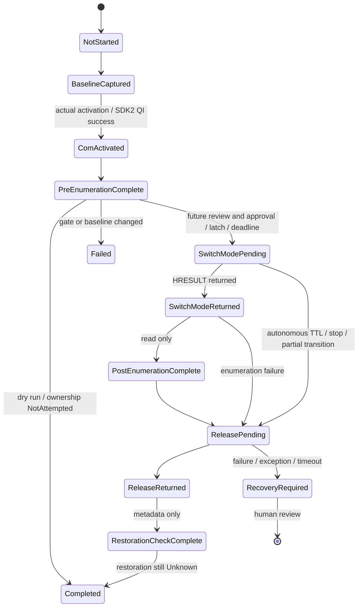

# Aura Gate A runbook — preparation complete, execution BLOCKED

**M2.8 archive status: `BlockedByAuraSdkRuntimeInstability`.** This remains a historical
M2.5 plan, not current execution guidance. Do not run the dry-run commands below during M2.8;
they still invoke the unreliable AuraSdk enumerator. The reviewed candidate and compiled false
gate are preserved unchanged. [Archive record](../archive/reports/AURA_GATE_A_ARCHIVE.md),
[replacement backend review](../architecture/AURA_BACKEND_SELECTION.md).

Prepared 2026-10-01/02. Do not execute ownership. `ReviewedReleaseValueKnown=true`, reserve=0,
but **ReviewedGateAExecutionEnabled=false**. MTA dry run returned a nonempty cached collection;
installed vendor ReleaseControl can internally call put_Color(0)/Apply. These side effects and the
restoration policy require explicit review before a revised candidate is enabled. An execution flag
cannot bypass the compiled gate. See [targeted analysis](../research/aura-ownership-callsite-analysis.md).
Production AuraWorker/WinUI/AceHFXService remain unchanged; no fan/HID fallback exists.

## Build, dry run and exact future command

Windows x64/MSVC/CMake/Windows SDK with C++WinRT are required. Static VC runtime; canonical existing
ABI header, no ASUS DLL copy. The experiment is excluded from solution/project references and normal publish.

```powershell
cmake -S tools/AuraOwnershipExperiment -B build/aura-gate-a -A x64
cmake --build build/aura-gate-a --config Release
# SAFE: no arguments = DRY RUN, metadata/COM activation/SDK2 QI/Enumerate/Count only.
& 'G:\Aura\build\aura-gate-a\Release\AuraOwnershipExperiment.exe'
```

Reviewed manifest/candidate: `audit_artifacts/phase3-m2.5/gate-a-candidate-reviewed/`. Verify hashes
before any future approved execution. The exact future command, after a revised enabled/reviewed
candidate and separate approval, would be:

```powershell
# NOT executed in M2.5. Current candidate remains BLOCKED even with this flag.
& 'G:\Aura\audit_artifacts\phase3-m2.5\gate-a-candidate-reviewed\AuraOwnershipExperiment.exe' --execute-gate-a
```

Do not flip a boolean/hash to bypass review. No extra arguments, TTL/path/DLL/CLSID/method/token option,
environment execution switch or GUI action enables control. CI never runs the candidate.

## Identity, baseline and execution stop gates

OS-derived TokenUser SID, integrity RID, elevation, PID, session, WTS connection state and Job membership
are captured. Non-medium/elevated/session-zero identity blocks before COM. Dry run can observe metadata
in an inactive session or inherited job; execute additionally requires active interactive session and
**no inherited Job Object**. Do not launch an approved owner through M2's kill-on-close mechanism,
WinUI, CI or Codex's job-bound shell. No breakaway bypass is provided; parent exit is not a stop signal.

SDK registration must be the fixed machine x64 Aura SDK path with ThreadingModel=Both. Per-user CLSID
override, SDK/ABI hash drift, missing SDK2, closed compiled gate, failed pre-enumeration, nonzero pre-count,
cancellation, journal failure or existing one-shot latch blocks acquisition. Pinning this experiment
is not the product's compatibility policy.

Baseline captures LightingService state/PID, SDK version/hash, UTC, current-user WDL flags, LampArray
DeviceInformation interfaces and GetDeviceCap.xml/DevLastStatConfig.xml hashes. TargetPrevalidated=false;
no target identity or M605 HID command. Each of eleven counts retains execution/HRESULT/null on failure.
Current MTA dry run returned Count=3 with one shared collection identity; unchanged M2 STA comparison
returned Count=0. Cause is UNKNOWN; neither observation proves ownership or three physical targets.

## Fixed future sequence

1. Create experiment ID/journal and capture baseline metadata.
2. Initialize MTA, activate the fixed AuraSdk class, QI **the same object** for IAuraSdk2.
3. Enumerate `0,0x10000–0x80000,0x120000,0x2F0000`, persist counts/HRESULTs/collection identities.
4. After all gates, atomically create a persistent one-shot review latch. Arm deadline/cleanup obligation
   before SwitchModePending is durably logged. Failed pending log prevents the call.
5. SwitchMode **once**; distinguish HRESULT return from exception/NotAttempted.
6. On success, while release/stop has not intervened, query the same categories. Device metadata is only
   Type/Name/Width/Height/Lights.Count, up to eight devices per category, truncation explicit. No light
   setter, optional light-color getter, Apply or second SDK instance.
7. Every ordinary path after attempted SwitchMode schedules original-instance ReleaseControl(0) **once**.
   Failed Switch/SEH can represent a partial transition; cleanup still attempts release, never token escalation.
8. After successful release return, re-enumerate the same cache and capture/compare metadata.
9. Final evidence collection can be Completed while restoration remains **Unknown**. Retain review latch;
   no automatic replay/retry/fallback. Empty cached post-count does not disprove acquisition/restoration.



## Owner lifecycle, TTL and limits

Fixed **5,000 ms release-attempt deadline**, armed before entering SwitchMode; **10,000 ms hard
ownership-sequence observer limit**. No CLI duration. Release completion observation budget is
**2,000 ms** from scheduling; timeout/failure is RecoveryRequired. Baseline bound=30 s; WDL query=2 s.

The owning process contains the vendor sequence, observer/timer and release thread. The release thread
retains its original SDK2 object; participating threads initialize MTA. RAII covers ordinary exceptions/
exit; at-most-once scheduling arbitrates timer/normal/console paths. Pure-software launcher/child test
proves parent disappearance does not end the owner fixture before its five-second release attempt.
No ownership lease depends on WinUI/heartbeat or SYSTEM broker. No Job Object is created by this executable.

MTA pointer sharing is COM-valid, but vendor concurrent-method safety is unvalidated. A watchdog can
attempt release during a hung read/SwitchMode, not cancel native calls or prove hardware restoration.
A SwitchMode return after release was already requested is RecoveryRequired. Timeout returns exit4
with outstanding-call evidence; ordinary process exit then ends outstanding threads and loses their
object. This is not successful release or hard-crash protection. SDK cleanup, scheduling/storage stalls,
vendor ExitProcess/fail-fast/corruption and forced owner death remain residual risks. Five seconds bounds
the attempt policy, not actual ownership cessation; journal I/O is also not a real-time OS guarantee.

Ctrl+C/Break/console-close signals internal stop, never calls COM on handler thread, waits at most1 s.
Windows may terminate earlier; shell/user32 loading may suppress logoff/shutdown callbacks. SEH/terminate
logging is best effort. No post-acquisition crash/kill/logoff/shutdown experiment was run or approved.
Sources: [MTA](https://learn.microsoft.com/en-us/windows/win32/com/multithreaded-apartments),
[console handlers](https://learn.microsoft.com/en-us/windows/console/setconsolectrlhandler),
[Job inheritance](https://learn.microsoft.com/en-us/windows/win32/procthread/job-objects).

## Journal, human evidence and failure policy

Fixed `%LOCALAPPDATA%\AceHFXAura\AuraOwnershipExperiment\<id>\journal.jsonl`, CREATE_NEW and
FILE_APPEND_DATA, per-record write/flush; bounds 256 records /2 MiB /32 KiB per entry with small failure
reserve. Includes experiment ID/PID/UTC/sequence, OS identity, ABI/review hashes, transitions, exact
results, attempted/returned flags, reserve and final status. No overwritten journal or caller path.
Emergency records can interleave after corruption; files are evidence, not authenticated control authority.
Vendor stdout is untrusted diagnostic text; journal is authoritative for app-issued call evidence.

`HUMAN_OBSERVATIONS.md` beside journal begins NOT_PROVIDED for VisualStateBefore,
VisualStateDuringOwnership, VisualStateAfterRelease, timestamp/observer and human restoration verification.
Owner captures BEFORE evidence before an approved run and fills honest observations afterwards,
including “not observed.” The process never waits for human input while owning and never emits a color
frame to aid observation. S_OK/process exit/zero count/service alive/journal Released alone are not proof.
Compare post-release enumeration, LightingService PID/state, WDL metadata and XML hashes; even unchanged
values can leave effective owner Unknown. Manufacturer describes default effect, not exact prior animation.

The fixed root `GATE_A_REVIEW_REQUIRED.json` latch is retained after any future attempt, even S_OK.
Only separate human review can authorize archiving it and another reviewed run. This milestone created
no latch because no real attempt was made; dry runs do not consume approval.

Failed HRESULT/exception/timeout/late Switch return/journal loss: **RECOVERY_REQUIRED**, retain evidence
and stop for human review. No token/control-state call, RGB output, Apply, SetLedMatrix, fan/EC/IOCTL/
ACPI/HID fallback, vendor service stop/restart/uninstall, reboot or automatic repeat. Crash experiments
remain deferred until normal release and externally observed restoration succeed in an approved run.

AURA_GATE_A_EXECUTION_APPROVAL_REQUIRED = true

GATE_A_BLOCKED
